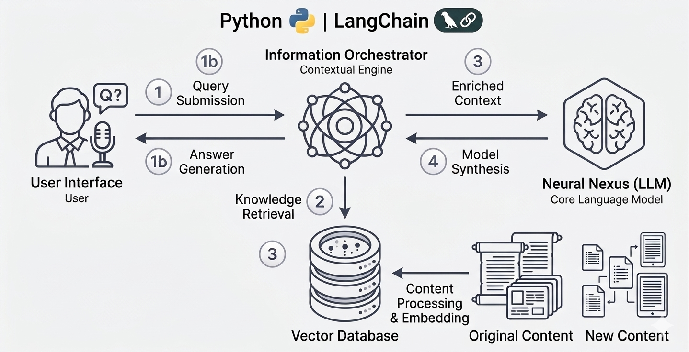
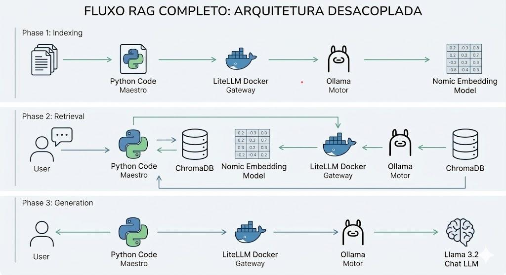
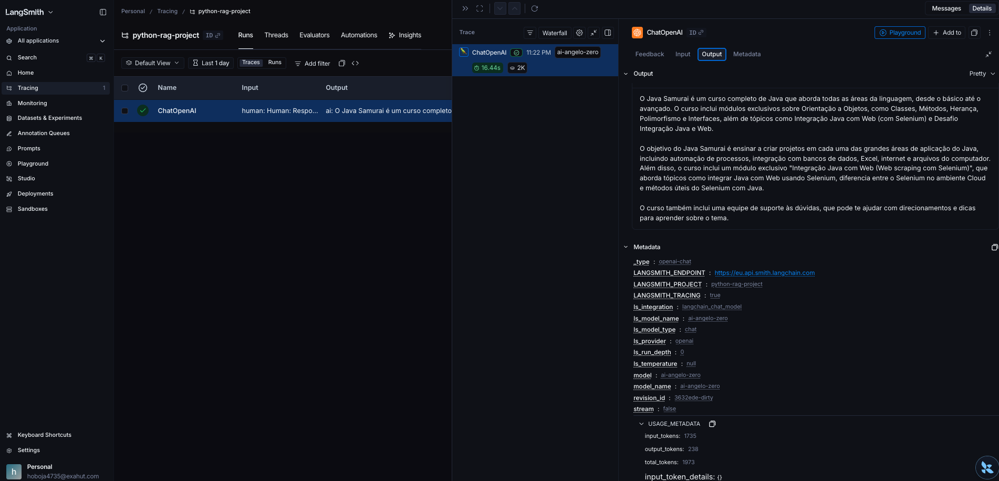

# Python Langchain - RAG




### O que é RAG ?
- RAG (Retrieval-Augmented Generation ou Geração Aumentada por Recuperação) resolve isso dando um "manual de consulta" para esse assistente.

1. **Retrieval (Recuperação):** Quando você faz uma pergunta, o sistema corre em uma biblioteca de documentos específicos (seus PDFs, notas ou banco de dados) e encontra os trechos que têm a resposta.

2. **Augmentation (Aumento):** O sistema pega a sua pergunta e "grampeia" junto com esses trechos encontrados, criando um contexto rico.

3. **Generation (Geração):** Ele entrega esse "pacote" para o assistente inteligente, que lê tudo e escreve uma resposta baseada apenas naqueles fatos reais.

---

#### Dividindo a base de conhecimento em "pedaços"
Imagine que você tem um manual de instruções de 500 páginas e precisa saber apenas ***"como trocar a pilha do controle remoto"***. Você poderia ler o livro inteiro do começo ao fim para achar essa frase, mas isso seria:

- **Demorado:** Você levaria horas para uma resposta de 10 segundos.
- **Cansativo:** Seu cérebro gastaria uma energia enorme processando informações inúteis (como a história da fábrica ou o descarte de embalagens).

Com a IA, acontece a mesma coisa. Se enviamos 500 páginas de uma vez teríamos dois problemas:
1.  **Lentidão:** Ela demora muito mais para processar tudo e te responder.
2.  **Custo:** As empresas de IA cobram por "quantidade de leitura". Ler 500 páginas para responder uma linha sai caríssimo no final do mês.


#### O que é Chunks ?

Para resolver isso, nós "fatiamos" o PDF em pequenos blocos de informação. É como se transformássemos aquele livrão em vários cartões de anotações (os **Chunks**). 

O processo funciona assim:

- **Organização (Vetorização):** Cada pedacinho de texto ganha um "endereço inteligente" baseado no assunto dele. Se um pedaço fala de "pilhas" e outro de "garantia", eles são guardados em gavetas diferentes.
- **Busca Inteligente:** Quando você faz uma pergunta, o sistema não lê o PDF todo de novo. Ele olha apenas para a sua pergunta, entende o assunto e vai direto na "gaveta" que tem o pedaço de texto correspondente.
- **Resposta Direta:** O sistema entrega para a IA apenas aqueles 2 ou 3 pedacinhos que realmente importam. 

**Resultado:** A IA responde de forma instantânea, com precisão e sem custo algum usando modelos locais.

---

### Utilizando Ollama (local e gratuito)

Este projeto utiliza o **Ollama** para rodar o modelo **Llama 3.2** localmente, sem necessidade de chave de API ou pagamento.

#### Pré-requisitos
1. Instale o Ollama: **[ollama.com](https://ollama.com)**
2. Baixe o modelo:
```bash
ollama pull llama3.2
```
3. Certifique-se que o Ollama está rodando antes de executar o projeto:
```bash
ollama serve
```

---

#### Configuração inicial
-   `uv add langchain`
-   `uv add langchain-ollama`
-   `uv add langchain-community`
-   `uv add langchain-chroma`
-   `uv add langchain-text-splitters`
-   `uv add langchain-prompty`
-   `uv add chromadb`
-   `uv add pypdf`

#### Criando o banco de dados vetorizado

Coloque seus arquivos PDF na pasta `base/` e execute:

```bash
uv run create_db.py
```

#### Fazendo perguntas ao RAG

```bash
uv run main.py
```

---

### Lanchain Smith - Monitorando suas Requisições

- Acesse [LangChain Smith](https://eu.smith.langchain.com/) e realize seu cadastro. 
- Crie seu projeto no site.
- Configure seu `.env` com as seguintes informações do site

```properties
# LANGCHAIN SMITH
LANGSMITH_TRACING=true
LANGSMITH_ENDPOINT=https://eu.api.smith.langchain.com
LANGSMITH_API_KEY=YOUR_LANGSMITH_API_KEY
LANGSMITH_PROJECT="python-rag-project"
OPENAI_API_KEY="api-key-angelo-1234"
```

- Execute a classe `main.py` e verifique os logs no site.



---

| Etapas de desenvolvimento |
| ----- |
| 01 - Criando a base de dados vetorizada com Ollama Embeddings |
| 02 - Implementando o RAG com ChatOllama |
| 03 - Migração de OpenAI para Ollama (local e gratuito) |
| 04 - Adicionando monitoria com LangChain Smith |

---

#### Referências:
- [Youtube - Agente de IA completo com Python - Projeto RAG com Langchain](https://www.youtube.com/watch?v=0M8iO5ykY-E)
- [Langchain Documentation](https://docs.langchain.com)

#### Código fonte do projeto
- [Github - AngeloZero](https://github.com/angelozero/python-rag-project)

#### Fluxograma 

```shell
1 - Indexação
    - PDF em Vetor
        - Python ------------- Lê o PDF e o fatia em pequenos pedaços (chunks).
        - LiteLLM (Docker) --- Recebe o chunk e olha no seu `config.yaml`.
        - Ollama ------------- Ativa o Modelo de Embedding (Aqui o LLM continua "dormindo")
        - Embedding: --------- Transforma e retorna o texto em uma lista de vetores.
        - ChromaDB ----------- Recebe os vetores

2 - Pergunta (Busca na Base)
    - Duvida do usuario
        - Python ------------- Recebe a pergunta do usuario
        - LiteLLM (Docker) --- Recebe a pergunta e aciona novamente o Modelo de Embedding no Ollama (transforma a pergunta em vetor).
        - ChromaDB ----------- Com o vetor da pergunta, o banco faz um cálculo de proximidade devolvendo 3 chunks.

3 - Geração de Resposta
    - Usando LLM
        - Python ------------- Pega os 3 chunks que o Chroma achou e monta um Prompt.
        - LiteLLM (Docker) --- Recebe esse prompt e agora, em vez de pedir um embedding, ele faz uma chamada de **Chat**. 
            - Atraves do config.yaml ele decide: "Mandar isso para o Llama 3.2".
        - Ollama é acionado ---  Aciona o LLM (Llama 3.2). 
        - LLM lê o contexto enviado, usa sua capacidade de raciocínio e redige uma resposta em linguagem natural.
        - LiteLLM recebe o texto final e entrega para o Python
        - Resposta para o usuário
```
